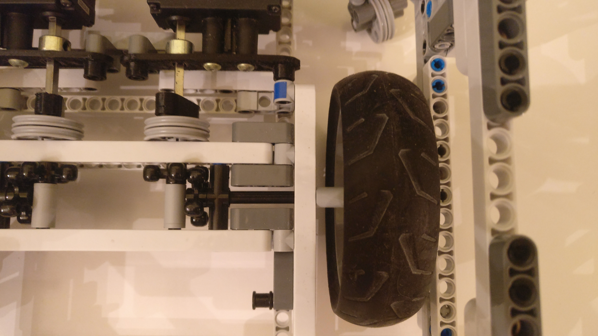

<div align="center">
  <h1>Trashket Robot</h1>
  <h3>Trash-catching mobile wastebasket</h3>
  <h4>Term project for GSU's Embedded Systems course in the spring of 2020 by Luke Smalley, Byron Mouen, and Christian Moronta</h4>
</div>
  
The course instructor was [Doctor Michael Weeks](https://hallertau.cs.gsu.edu/~mweeks/index.html), who maintains [this webpage](https://hallertau.cs.gsu.edu/~mweeks/csc4110/) for the course in current and past terms (Those links are active as this document is written, but is apparently running on some box inside the GSU CS department, so may not be available forever).

The statement submitted for the project abstract/goal was the following:
> Trashketball is the game that every ambitious person with a wad of trash will probably engage in. One plays trashketball using a wad of trash and a trash basket (trashket). A game of trashket ball consists of one or more attempts to toss one's trash into the basket from any distance. One wins at trashketball by throwing the trash such that it lands inside the trashket.
The goal of this project is to create a trashket that moves by itself so that it will catch any trash thrown at it with as much success as possible. To accomplish this, we must construct a mobile robotic system with the capability to track thrown objects. This requires a wastebasket be assembled with a number of other distinct subsystems:<br>- A mobility subsystem that can change direction and move quickly<br>- A vision subsystem to track thrown trash<br>- A subsystem to detect caught trash and keep score (optionally)

Prior art research yielded only the mobile trash can developed by Japanese engineer Minoru Kurata (See Kurata's [development and home demo video](https://www.youtube.com/watch?v=NqDTE6dHpJw) and [expo demo](https://www.youtube.com/watch?v=ZNWd4FFYDv0)). Kurata's trash can uses an elaborate custom-fabricated driving base that allows it to change its direction of travel without rotating the chassis or wastebasket. Thrown trash was tracked using a wall-mounted Microsoft Kinect. Duplicating the mobility system of this device was well beyond our fabrication capabilities. Based on this research, we knew we could either approach object tracking using a stationary camera or a camera mounted to the mobile assembly.

### Initial Prototype

We had plenty of hobby microcontrollers and cameras available between ourselves, but no suitable sets of compatible chassis parts and motors. Since suitably-powerful motors are expensive in the context of a college course, we designed the driving base using the minimum number of motors necessary. A two-wheel, two-motor driving base would minimize the cost of parts, albeit sacrificing our ability to turn quickly. We prepared to buy the lowest-cost motors, but a friend lent us a pair of [VEX 393 motors](https://www.vexrobotics.com/motors.html), along with the 7.2V batteries used by the VEX system.

LEGO Technic parts were the most readily accessible material for a chassis, but the VEX motors needed to be attached to the LEGO beams, gearing, and wheels. Because we had access to a 3D printer, we designed and printed components to connect VEX motors and axle to Technic parts.

<div align="center">
  <p><i>Renders of the VEX-LEGO axle coupler and motor mount bracket</i></p>
  
  
  <p><i>VEX motors with 1/8" axle mounted and interfaced with the final LEGO chassis</i></p>
  
</div>

An initial prototype served as proof-of-concept for the circuitry, though it was not complex. The chassis was constructed to carry the minimum necessary electronics, but not a full-sized trash can. This first assembly was also a test of strength for the chassis and gearing, to see if the LEGO parts could support the torque of the VEX motors. The prototype only used two MOSFETs to control the motors, and could only drive forward. The electronics configuration of the first prototype was as follows:

```
    +--------------+                 +--------+     +------------+
    | 7.2V Battery | -----------.--> | MOSFET | --> | Left Motor |
    +--------------+            |    +--------+     +------------+
           |                    v         ^ 
           v                 +--------+   |    +-------------+
+-----------------------+    | MOSFET | --:--> | Right Motor |
| 6-12V to 5V Converter |    +--------+   |    +-------------+
+-----------------------+         ^       |
           |                      |       |
           v                      |       |
   +-----------------+            |       |
   | Raspberry Pi 3B | -----------'-------' 
   +-----------------+
```

<div align="center">
  <p><i>Wonderful photo of the first prototype</i></p>
  
</div>

A worthwhile note about the photo above: the black PCBs slotted into the breadboard are the MOSFETs which regulate motor speed. The boards include a transistor and opto-isolator between the control pin and MOSFET base. Unnecessary as that may be, I already had several around. Additionally, I'm not an electrical engineer.

We used a very simple Python program, running on the Raspberry Pi depicted above, to verify that the robot functioned:

```python
# trashket-robot/scripts/circle.py

from gpiozero import PWMLED
from time import sleep

left = PWMLED(17)
right = PWMLED(22)

try:
  left.value = 0.1
  while True:
    right.value = 0.1
    sleep(2)
    right.value = 0
    sleep(2)
except: # Ctrl-C is used to interrupt the loop and end the program.
  left.value = 0
  right.value = 0
```

### Final Prototype

Since the first prototype functioned properly, a redesign of the chassis began. The base was rebuilt large enough to support a mounted wastebasket. Larger wheels were used to provide as much speed as possible. The increase in size meant that the complicated gear train from the first prototype could be reduced to a single 90-degree turn from each motor to its respective wheel.

<div align="center">
  <p><i>Reconstructed chassis with a larger body and larger wheels</i></p>
  
  <p><i>The reconstructed chassis with the wastebasket mounted atop</i></p>
  
  <p><i>A top-down view of the reconstructed chassis</i></p>
  
  <p><i>An ultra-simple drive chain</i></p>
  
</div>

The circuits for the final model underwent several changes, as initially I thought four MOSFETs could provide bi-directional control for the motors. This was because the schematics for the MOSFET boards included diodes, so I had assumed backwards current flow was not possible. Several configurations, which all produced that wonderful blue smoke, proved this not to be the case. This development occurred during our final group meeting, which was before or near the beginning of Georgia's COVID shelter-in-place recommendation. As a result, the latest and final iteration of the robot uses an 8-relay board and a single MOSFET to control driving direction and speed, respectively. This was what we had on hand at the time the final changes had to be made. We also anticipated a need to upgrade to a double-battery configuration due to lack of power, but actually the change had to be made for a separate reason. The current drop resulting from engaging the motors consistently caused the Pi to reboot, so we moved the controller to a separate battery. The final electronics were arranged as such:

```
    +--------------+      +--------------+   
    | 7.2V Battery |      | 7.2V Battery |                          +------------+
    +--------------+      +--------------+                     .--> | Left Motor |
           |                      |                            |    +------------+
           v                      v                            |
+-----------------------+    +--------+     +--------------+   |    +-------------+
| 6-12V to 5V Converter |    | MOSFET | --> | Relay Module | --'--> | Right Motor |
+-----------------------+    +--------+     +--------------+        +-------------+
           |                      ^
           v                      |
   +-----------------+            |
   | Raspberry Pi 3B | -----------'
   +-----------------+
```

<div align="center">
  <p><i>An annotated photo of the final prototype electronics</i></p>
  
</div>

The electronics were placed in the tray as pictured, and the tray mounts on the inside of the assembly, underneath the wastebasket, and above the batteries and drivechain. The batteries are housed in the bottom-front of the assembly.

### Premature Conclusion

We were not able to complete the project goals within the semester's time for a few reasons:
* We began devoting significant time to motion coordination via object tracking only after the driving base was fully complete.
* COVID significantly reduced our opportunities to collaborate on the project in-person.
* Issues remained in the final iteration of the driving base, but there was insufficient time to address them.

As our deadlines approached, Christian completed a script that provides remote control of the robot via webpage served from the Pi using Flask ([`scripts/server.py`](./scripts/server.py)). From that point he was also working on combining Byron's exploratory OpenCV scripts into control program ([`scripts/mask.py`](./scripts/mask.py) and [`scripts/mask_control.py`](./scripts/mask_control.py)). We mounted the Raspberry Pi camera on the front of the wastebasket, and were not forced to find change its positioning before the term ended.

Once the electronic issues were resolved in the final prototype, it became apparent that the gear-holding portions of the chassis were not constructed sturdily enough. The force of the high-torque motors and weight of the fully-assembled robot caused the beams around the gears to pull apart and allow the gears to slip. To reach a functional robot, we would have needed to reinforce this area around the gears.

The final results of the project inside the semster's time are presented in [our video](https://www.youtube.com/watch?v=Uu7vC66wiq0), which at time-of-writing is available on Christian's YouTube channel.

#### Lessons Learned
* Be diligent about dividing before conquering.
* H-bridges are four transistors, not two.
* Blue smoke smells worse than I think it does.
